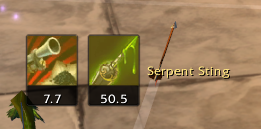

# Hamingway's HunterTools (Vanilla 1.12 / Turtle WoW)

## Version 1.1.0

> ⚠️ **SuperWoW Notice**
> New features introduced in v1.1.0 (Proc Frame, accurate buff timers) require [SuperWoW](https://github.com/balakethelock/SuperWoW) by Balake.
> The addon will continue to work without SuperWoW, but new features will be unavailable.
> **Future versions will require SuperWoW as a hard dependency.**

---

## What's New in v1.1.0

### Proc Frame *(requires SuperWoW)*
Tracks active hunter procs from Turtle WoW 1.18.1 talents and displays them as moveable icons with timers.



**Lock and Load** — Shows remaining duration. When active, LazyHunt automatically replaces Steady Shot with Aimed Shot (1s cast with LnL).

**Experimental Ammunition** — Detects all three variants and shows which spell to cast next:
| Icon | Proc | Cast |
|------|------|------|
| 🔥 | Explosive Ammunition | Multi-Shot |
| 🟢 | Poisonous Ammunition | Serpent Sting |
| 🟣 | Enchanted Ammunition | Arcane Shot |

**Configuration:** Options → Tab "Proc Frame"
- Enable/disable entire frame or individual procs
- Adjustable icon size
- Show Always (visible even when no proc is active)
- Moveable & lockable like all other HHT frames

**LazyHunt API:**
```lua
HHT_ProcState_LnL()    -- returns true/false
HHT_ProcState_Ammo()   -- returns 0=none, 1=explosive, 2=enchanted, 3=poisonous
```

---

## Earlier Changes

### v1.0.4
✅ Added `NotifyCastAuto()` API for user macros
✅ Simplified cast notification (auto-calculates cast time from spell database)

### v1.0.3
✅ PetFeeder Memory Leak Fixed
✅ Real-time Food Count Updates
✅ Happiness Color Display Fixed

### v0.8.x
✅ Range Detection System (Quiver-Style) with Dead Zone blink warning
✅ Melee Timer with Parry/Dodge/Block detection
✅ Hunter class check

### v0.7.0
✅ GCD-based Instant Shot Detection
✅ Revive Pet Icon & Castbar
✅ Mount-Detection for Turtle WoW

---

## Installation
Copy the `HamingwaysHunterTools` folder into your `Interface/AddOns` directory.

**With SuperWoW (recommended):** Install [SuperWoW](https://github.com/balakethelock/SuperWoW) for full feature support including accurate proc timers.

---

## Features
- **Auto Shot Timer**: Visual bar showing ranged weapon cooldown with precise timing
- **Melee Swing Timer**: Shows melee attack cooldown (hits, crits, misses, parries, dodges, blocks)
- **Range Detection**: Target distance category with Dead Zone blink warning
- **Proc Frame**: Lock and Load + Experimental Ammunition tracking *(SuperWoW)*
- **Castbar**: Visual cast progress for Steady Shot, Multi-Shot, etc.
- **Ammo Tracking**: Monitor ammunition count
- **Pet Feeder**: Automatic pet feeding system
- **Tranq Shot Tracker**: Monitors enrage dispels
- **Warning System**: Configurable combat warnings

---

## Commands
- `/hht` — Open options
- `/hht reset` — Reset frame positions
- `/hht proc scan` — Scan and print all active buffs/debuffs (for debugging)

---

## API for Macros (v1.0.4+)

**Multi-Shot Macro:**
```
/cast Multi-Shot
/script HamingwaysHunterTools_API.NotifyCastAuto("Multi-Shot")
```

**Aimed Shot Macro:**
```
/cast Aimed Shot
/script HamingwaysHunterTools_API.NotifyCastAuto("Aimed Shot")
```

---

## Technical Notes
- Saved variables: `SavedVariablesPerCharacter: HamingwaysHunterToolsDB`
- Range detection uses `CheckInteractDistance()` and `IsActionInRange()` (boolean only — no exact yards in Vanilla)
- Requires Auto Shot on action bar (can be hidden) for ranged detection

## License
No license specified — treat as example code for the community
