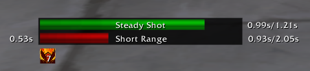

# Hamingway's Hunter Tools

A comprehensive, feature-rich Hunter addon for World of Warcraft Classic (1.12) that provides everything you need for optimal Hunter gameplay.


## 🎯 Features

### AutoShot Timer



- **Quiver-style timer** with red reload and yellow windup phases
- **Range indicator** shows Steady Shot (green) and Short Range (red)
- **Precise tracking** with elapsed/total time display
- **Haste buff tracking** (Rapid Fire, Quick Shots, Berserking)
- **Cast bar** for Aimed Shot, Multi-Shot, etc.
- Fully customizable colors, sizes, and positions

### Pet Feeder System
- **Smart auto-feeding** when pet happiness drops
- **One-click feeding** with favorite food selection
- **Food blacklist** - automatically remembers rejected food
- **Visual happiness indicator** (green/yellow/red background)
- **Pet portrait** with Call/Dismiss/Revive on click
- Food inventory tracking with count display

### Tranq Shot Rotation Tracker
- **Raid-wide cooldown tracking** for all hunters
- **Visual progress bars** showing CD status per hunter
- **Missed shot warnings** with fade-in/fade-out effect
- **Automatic rotation management** in raid groups
- Helps coordinate Tranquilizing Shot on raid bosses

### Buff & Aspect Warnings
- **Trueshot Aura reminder** with blinking icon
- **Aspect tracker** - warns when wrong/missing aspect is active
- **Click-to-cast** - click icons to cast missing buffs
- Auto-cast option for Trueshot Aura
- Fully configurable per aspect type

### Statistics Tracking
- **Reaction time measurement** between Auto Shot end and cast start
- Average, best, and worst performance tracking
- Skipped and delayed cast counters
- Helps optimize your weaving technique

### Ammunition Tracking
- **Ammo counter** displays remaining arrows/bullets
- **Low ammo warning** when supply runs low
- **Automatic detection** of equipped ammo type
- Clean, minimal display integrated into main frame

## 📥 Installation

### Method 1: Manual Installation (Recommended)
1. Download the latest release from [Releases](../../releases)
2. Extract the ZIP file
3. Copy the `HamingwaysHunterTools` folder to `World of Warcraft\_classic_\Interface\AddOns\`
4. Restart WoW or type `/reload` in-game

### Method 2: Git Clone (For Developers)
```bash
git clone https://github.com/xindlemeister-create/HamingwaysHunterTools.git
```
Then copy the `AddOns/HamingwaysHunterTools` folder to your WoW directory.

## 🎮 Usage

### Opening the Config
- Type `/hht` or `/hamingway` in chat
- Or click the minimap button (if enabled)

### Quick Commands
- `/hht` - Open configuration panel
- `/hhtresetwarning` - Reset warning frame position
- `/hhtpreview` - Test Tranq rotation display with fake data

### Configuration Tabs
1. **AutoShot** - Timer settings, colors, and display options
2. **Castbar** - Cast bar configuration
3. **Buffs** - Haste buff tracking settings
4. **Ammunition** - Ammo counter display
5. **Statistics** - View and reset performance stats
6. **Pet Feeder** - Pet feeding automation and food selection
7. **Melee** - Melee swing timer options
8. **Warnings** - Trueshot and Aspect warnings
9. **Tranq** - Tranquilizing Shot rotation tracker
10. **Appearance** - Frame locking, borders, and bar styles

## 🎨 Customization

### Bar Styles
- **Blizzard** - Default WoW status bar texture
- **Smooth** - Clean gradient fill
- **Flat** - Solid color bar

### Border Styles
- **Tooltip** - Standard tooltip border
- **Dialog** - Dialog window border
- **Simple** - Minimalist thin border

### Colors
Fully customizable colors for:
- Auto Shot phases (aiming, cooldown, ready)
- Melee swing timer
- Cast bar
- Background opacity

## 🔧 Technical Details

### Performance
- **Optimized update cycles** - throttled to 10 Hz for non-critical updates
- **Texture-based buff detection** - 10,000x faster than tooltip scanning
- **Object pooling** - zero garbage collection in combat
- **Quiver-level efficiency** - minimal CPU and memory footprint (~400 KB in 40-man raids)

### Lua 5.0 Compatibility
Fully compatible with WoW 1.12's Lua 5.0 environment:
- Uses `math.mod()` instead of `%` operator
- Proper nil-safe comparisons
- No modern Lua syntax

### Architecture
- **Modular design** - separate files for Tranq, Warnings, and Pet Feeder
- **Shared database** - `HamingwaysHunterToolsDB` for all settings
- **Event-driven updates** - efficient PLAYER_AURAS_CHANGED handling
- **Texture-based bars** - proper Z-order for text layering

## 🐛 Known Issues

- Auto-feeding requires player-initiated action (WoW 1.10+ limitation)
- Cast detection relies on SPELLCAST_START event
- Tranq cooldown sync requires raid group membership

## 🤝 Contributing

Contributions are welcome! Feel free to:
- Report bugs via [Issues](../../issues)
- Submit feature requests
- Create pull requests with improvements

## 📜 License

This project is licensed under the MIT License - see the [LICENSE](LICENSE) file for details.

## 🙏 Credits

Inspired by classic addons:
- **Quiver** - Performance optimization patterns
- **WeaponSwingTimer** - Swing timer mechanics
- **CT_RaidAssist** - Raid coordination features

## 📞 Support

- **Issues**: [GitHub Issues](../../issues)
- **Discussions**: [GitHub Discussions](../../discussions)

---

**Made with ❤️ for the Classic WoW Hunter community**
